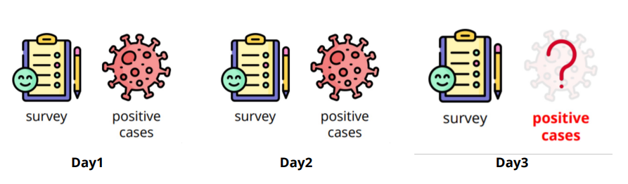

# 🦠 HW1-Regression COVID Prediction

## 🥊 Introduction

[Kaggle link](https://www.kaggle.com/competitions/ml2023spring-hw1/overview)

HW1 的任务是根据美国某个州**过去三天**的调查结果，预测第三天的**新增检测阳性病例**的百分比。



训练数据有 3009 条，测试数据为 997 条。使用均方误差 (MSE) 作为评估指标。其中每一条包含 88 个 Feature，
详情如下：

- id (1)
- States (34，使用 one-hot 编码)
- **Survey (18 * 3 days)**
    - COVID-like illness (5)
        - cli, ili …
    - Behavior indicators (5)
        - wearing_mask, shop_indoors, restaurant_indoors, public_transit …
    - Belief indicators (2)
        - belief_mask_effective, belief_distancing_effective.
    - Mental indicator (2)
        - worried_catch_covid, worried_finance.
    - Environmental indicators (3)
        - other_masked_public, other_distanced_public …
- **Tested Positive Cases (1 * 3 days)**
    - tested_positive (第三天的 tested_positive 是需要我们预测的)

## 🎯 Baseline

|        | Score   | Hint                                                                                      | Achieved |
|--------|---------|-------------------------------------------------------------------------------------------|----------|
| simple | 1.96993 | Just run [sample code](https://www.kaggle.com/code/b08502105/ml2023spring-hw1-samplecode) | ✅        |
| medium | 1.15678 | Feature selection                                                                         | ✅        |                                                                                                                                               
| strong | 0.92619 | Different optimizers and L2 regularization                                                | ✅        |
| boss   | 0.81456 | Better feature selection, different model architectures and try more hyperparameters      | ❎        |

## 🕹️ Get Started

```shell
git clone https://github.com/hsushuai/ML-HY-Lee.git

cd HW1-Regression

python main.py --data_dir <YOUR DATA DIRECTORY> --output <YOUR OUTPUT DIRECTORY>
```

当你将代码部署到云上训练时，你需要将数据集上传到云上，并在执行命令中设置数据集目录：`<YOUR DATA DIRECTORY>` 和输出
目录：`<YOUR OUTPUT DIRECTORY>`。然而，事实上由于数据集很小所以已经将其包含在了 HW1 的项目文件中。
不设置 `--data_dir <YOUR DATA DIRECTORY>` 也是可以的。

如果你是在本地运行代码，无需设置数据集和输出目录，程序会自动新建 `output` 目录到 `HW1-Regression` 目录下。

此外，我们开提供了一些其他命令行配置，以便于训练调参

- `--epochs <NUM EPOCHS>` ： 训练的 epoch 数；
- `--batch_size <BATCH SIZE>` ：训练的 batch 大小；
- `--learning_rate <LEARNING RATE>` ：训练的学习率。

## 📕 Docs

### Leaderboard Score

在完成 HW1 时，我们做了大量尝试，最终只达到了 Pubic score: 0.80839，Private score: 0.85028。


### Feature Select

特征选择的探索过程可见 [feature_select.ipynb](notebooks/feature_select.ipynb)。
简单来说，我们参考了 [a86gj387](https://zhuanlan.zhihu.com/p/483652591) 的方法，
计算 Feature 和 tested_positive 的相关度，只选择相关度 $>0.5$ 部分的 17 个 特征。

### Network Architecture

[a86gj387](https://zhuanlan.zhihu.com/p/483652591) 仅使用了一层 64 维隐藏层，然而我在实验过程中
发现使用 3 层隐藏层的效果更好一些，可能是我在训练过程中加入了 L2 正则化，但具体是什么原因依然是一个玄学的谜。

```python
net = nn.Sequential(
    nn.LazyLinear(64),
    nn.LeakyReLU(),
    nn.LazyLinear(64),
    nn.LeakyReLU(),
    nn.LazyLinear(64),
    nn.LeakyReLU(),
    nn.LazyLinear(1)
)
```

### ⚙️ Configs

相关参数设置在 [config.yaml](configs/config.yaml) 文件中，具体如下：

```yaml
data:
  data_dir: "./data"
  seed: 8590  # Your seed number, you can pick your lucky number. :)
  valid_ratio: 0.1  # validation_size = train_size * valid_ratio

model:
  num_layers: 5
  hidden_size: 64

training:
  batch_size: 256
  epochs: 3000
  learning_rate: 0.001
  optimizer: "adam"  # adam or sgd
  weight_decay: 0.0001
  criterion: "mse"  # mse or cross_entropy
  early_stop: 600  # If models has not improved for this many consecutive epochs, stop training.
  output_dir: "./output"
```

更多详细的设置请参考源代码。

## 🙌 Help Us Do Better

虽然最终的 Public Score 达到了 Strong，但是 Private Score 还是差了不少。如果你有更好的 Solution 欢迎分享。
或者如果你遇到了什么问题，欢迎提交 issue。
