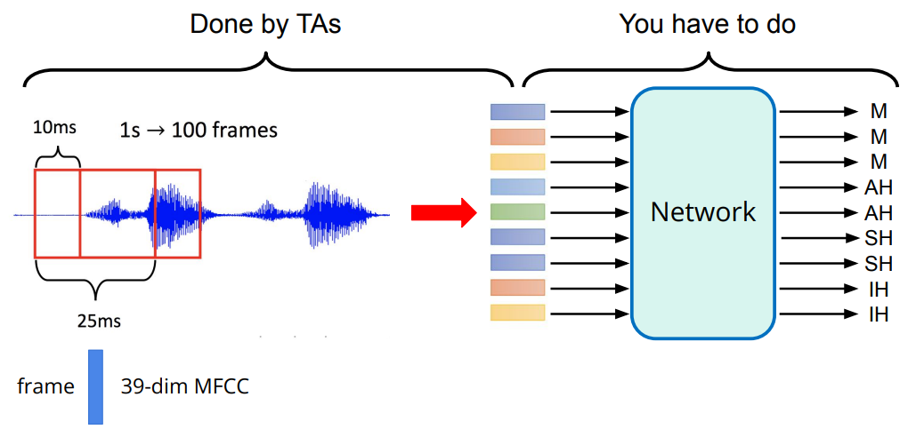
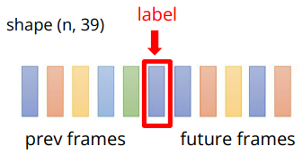

# 📢 HW2-Classification: Phoneme Recognition

## 🥊 Introduction

[Kaggle link](https://www.kaggle.com/competitions/ml2023spring-hw2)

HW2 的任务是音素 (Phoneme) 辨识。

> 💡 音素是语言学中的基本音位单位，是一种言语中的最小音位，可以在特定语言中将一个单词与另一个单词区分开来。
>
> *e.g.* **Machine Learning** → `M AH SH IH N` `L ER N IH NG`

我们将一段语音按每 25ms 分割成一帧，每帧之间有 10ms 的偏移。
每一帧通过一些数据预处理将其变成 **39-dim** 的 [MFCC](https://en.wikipedia.org/wiki/Mel-frequency_cepstrum) (Mel
Frequency Cepstral Coefficient) 特征。
将每一帧作为 Network 的输入，输出其对应的音素。



- Training data: 3429 个预处理后的 MFCC 特征 (2116794 帧)；
- Test data: 857 个预处理后的 MFCC 特征 (527364 帧)；
- Label: 41 个类别, 每一个类代表一个音素。

TA 已经将特征提取并以 Tensor 格式保存与`libriphone` 文件夹中：

- `test_split.txt` : 测试数据集的 feature id
- `train_labels.txt` : 训练数据集的 feature id 和其对应 labels
- `train_split.txt` : 训练数据集的 feature id
- `feat/test/` : 测试数据集的 features。每个 feature 保存为 Tensor，文件名为 "{feature_id} + .pt"
- `feat/train/` : 训练数据集的 features。每个 feature 保存为 Tensor，文件名为 "{feature_id} + .pt"

由于每帧只有 25 ms 的语音，单个帧不太可能表示一个完整的音素，一个音素会跨越多个帧。
所以我们连接相邻的帧用于训练。



## 🎯 Baseline

|        | Public Baseline | Hints                         | Training Time | Achieved |
|--------|-----------------|-------------------------------|---------------|----------|
| Simple | 0.49798         | sample code                   | ~30 min       | ✅        |
| Medium | 0.66440         | concat n frames, add layers   | 1~2 h         | ✅        |
| Strong | 0.74944         | batch norm, dropout           | 3~4 h         | ✅        |
| Boss   | 0.83017         | sequence-labeling (using RNN) | 6~ h          | ❎        |

## 🕹️ Get Started

```shell
git clone https://github.com/hsushuai/ML-HY-Lee.git

cd HW2-Classification

python main.py --data_dir <YOUR DATA DIRECTORY> --output_dir <YOUR OUTPUT DIRECTORY>
```

当你将代码部署到云上训练时， 你需要将数据集（直接从 [Kaggle](https://www.kaggle.com/competitions/ml2023spring-hw2/data) 上下载的压缩包 `ml2023spring-hw2.zip`）上传到云上，并在执行命令中设置数据集目录路径：`<YOUR DATA DIRECTORY>` 和输出目录路径：`<YOUR OUTPUT DIRECTORY>`。

如果你是在本地运行代码，同样需要设置包含 `ml2023spring-hw2.zip` 文件的目录路径和输出的目录路径。
或者不置定数据集和输出路径，直接将 `ml2023spring-hw2.zip` 文件复制到 `HW2-Classification/data` 路径下，
程序会默认新建 `HW2-Classification/output` 文件夹作为输出路径。

此外，我们开提供了一些其他命令行配置，以便于训练调参：

`--epochs <NUM EPOCHS>` ： 训练的 epoch 数；
`--batch_size <BATCH SIZE>` ：训练的 batch 大小；
`--learning_rate <LEARNING RATE>` ：训练的学习率；
`--concat_nframes` ：合并前后帧后的每个特征包含帧数量，n 必须是奇数 (n = 2k + 1)。

你可以使用以下命令查看支持命令配置的详细信息：

```shell
python main.py --help
```

## 📕 Docs

### Leader board Score


### Network Architecture

**LSTM + MLP**: 输入先经过 LSTM 在进入 MLP 然后输出

- LSTM
  - `hidden_size = 256`
  - `num_layers = 3`
- MLP
  - `hidden_size = 128`
  - `hidden_layers = 1`

在确定网络结构时尝试了多组不同的超参数设置发现：

- LSTM 层数不宜过大，3 层时效果最好；
- 增加 LSTM 隐藏层大小可以缓慢地提升网络能力，但是训练速度也会显著降低，256 是一个适中的选择；
- MLP 可以提升网络能力；
- MLP 层数过多会降低网络能力，1 层最佳；
- MLP 隐藏层大小几乎对网络能力没影响，设置为 128 即可。

### More Configs
## Baseline

```yaml
data:
  seed: 8590
  valid_ratio: 0.1
  concat_nframes: 19

training:
  batch_size: 512
  num_epochs: 15
  learning_rate: 0.001
  optimizer: "AdamW"
  weight_decay: 0.0001
  dropout: 0.5
  criterion: "cross_entropy"
  early_stop: 3
```

其中设置更大的 `concat_nframes` 可以缓慢地提升网络能力，但是会显著降低训练速度！

更多配置详见 [config.yaml](configs/config.yaml)。

## 🙌 Help Us Do Better

虽然使用了 LSTM ，但是最终的 Private Score 仅达到了 Strong，且距离 Boss 还是差了不少。如果你有更好的 Solution 欢迎分享。 或者如果你遇到了什么问题，欢迎提交 issue。
