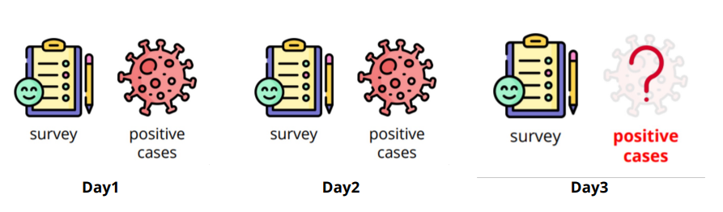
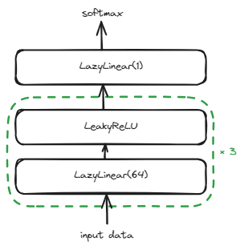

# 🦠 HW1-Regression COVID Prediction

## 📖 Introduction

[HW1](https://www.kaggle.com/competitions/ml2023spring-hw1/overview) 的任务是根据美国某个州**过去三天**的调查结果，预测第三天的
**新增检测阳性病例**的百分比。



训练数据有 3009 条，测试数据为 997 条。使用均方误差 (MSE) 作为评估指标。其中每一条包含 88 个 features，
每个 feature 详情如下：

- id (1)
- States (34，使用 one-hot 编码)
- **Survey (18 * 3 days)**
    - COVID-like illness (5)
        - cli, ili …
    - Behavior indicators (5)
        - wearing_mask, shop_indoors, restaurant_indoors, public_transit …
    - Belief indicators (2)
        - belief_mask_effective, belief_distancing_effective.
    - Mental indicator (2)
        - worried_catch_covid, worried_finance.
    - Environmental indicators (3)
        - other_masked_public, other_distanced_public …
- **Tested Positive Cases (1 * 3 days)**
    - tested_positive (第三天的 tested_positive 是需要我们预测的)

## 🎯 Baseline

|        | Score   | Hint                                                                                      | Public | Private |
|--------|---------|-------------------------------------------------------------------------------------------|--------|---------|
| simple | 1.96993 | Just run [sample code](https://www.kaggle.com/code/b08502105/ml2023spring-hw1-samplecode) | ✅      | ✅       |
| medium | 1.15678 | Feature selection                                                                         | ✅      | ✅       |                                                                                                                                               
| strong | 0.92619 | Different optimizers and L2 regularization                                                | ✅      | ✅       |
| boss   | 0.81456 | Better feature selection, different model architectures and try more hyperparameters      | ✅      | ❌       |

## ️⚡ Quick Start

下载数据集：

```bash
wget https://github.com/hsushuai/ml2023spring-hw/releases/download/dataset/ml2023spring-hw1.zip

unzip ml2023spring-hw1.zip
```

运行 hw1：

```bash
python main.py hw1 --data_dir YOUR_DATA_DIRECTORY --output YOUR_OUTPUT_DIRECTORY
```

你需要将 `YOUR_DATA_DIRECTORY` 和 `YOUR_OUTPUT_DIRECTORY` 替换成实际的数据目录和输出目录，默认为 'data/ml2023spring-hw1'
和 'output'。

❗ 注意，请确保数据目录结构如下：

```text
data_dir/
│
├── covid_train.csv
└── covid_test.csv
```

## 📕 Docs

### Leaderboard Score

在完成 HW1 时，我们做了大量尝试，最终只有 Public Score 过了 Boss Baseline，Private 只有过 Strong。


### Feature Select

特征选择参考了 [a86gj387](https://zhuanlan.zhihu.com/p/483652591) 的方法，
计算 Feature 和 `tested_positive` 的相关度，只选择相关度 $>0.5$ 部分的 17 个 特征。

### Network Architecture



### Configs

|          | Parameter     | Value  |
|----------|---------------|--------|
| Model    | num_layers    | 5      |
|          | hidden_size   | 64     |
| Training | batch_size    | 256    |
|          | max_epochs    | 1000   |
|          | learning_rate | 0.001  |
|          | weight_decay  | 0.0001 |
|          | early_stop    | 600    |

更多详细的设置请参考源代码 [hw1-configs](../configs/hw1-config.yaml)。

### 🎭 Tricks

这里的优化器使用了 Adam。

## 🙌 Contribute

虽然最终的 Public Score 达到了 Strong，但是 Private Score 还是差了不少。如果你有更好的 Solution 欢迎分享。
或者如果你遇到了什么问题，欢迎提交 issue。
