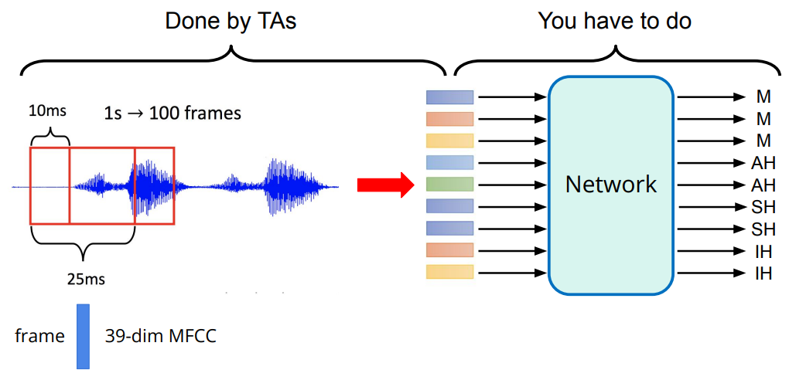
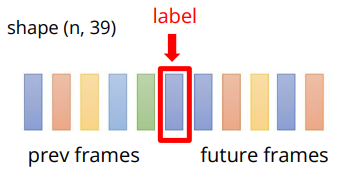
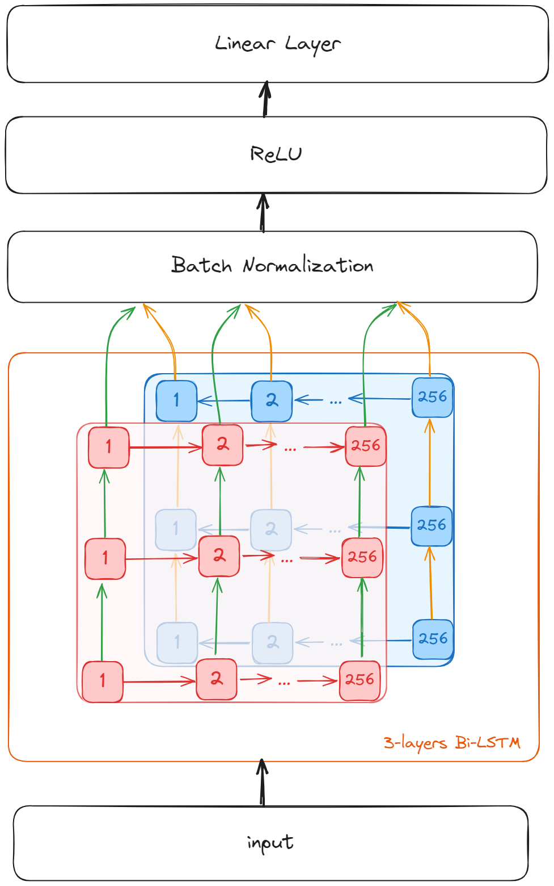

# 📢 HW2-Classification: Phoneme Recognition

## 📖 Introduction

[HW2]((https://www.kaggle.com/competitions/ml2023spring-hw2)) 的任务是音素 (Phoneme) 分类。

> 💡 音素是语言学中的基本音位单位，是一种言语中的最小音位，可以在特定语言中将一个单词与另一个单词区分开来。
>
> *e.g.* **Machine Learning** → `M AH SH IH N` `L ER N IH NG`

我们将一段语音按每 25ms 分割成一帧，每帧之间有 10ms 的偏移。
每帧通过预处理将其变成 **39-dim** 的 [MFCC](https://en.wikipedia.org/wiki/Mel-frequency_cepstrum) (Mel
Frequency Cepstral Coefficient) 特征。
将每一帧作为 Network 的输入，输出其对应的音素。



- Training data: 3429 个预处理后的 MFCC 特征 (2116794 帧)；
- Test data: 857 个预处理后的 MFCC 特征 (527364 帧)；
- Label: 41 个类别, 每一个类代表一个音素。

TA 已经将特征提取并以 Tensor 格式保存与`libriphone` 文件夹中：

- `test_split.txt` : 测试数据集的 feature id
- `train_labels.txt` : 训练数据集的 feature id 和其对应 labels
- `train_split.txt` : 训练数据集的 feature id
- `feat/test/` : 测试数据集的 features。每个 feature 保存为 Tensor，文件名为 "{feature_id} + .pt"
- `feat/train/` : 训练数据集的 features。每个 feature 保存为 Tensor，文件名为 "{feature_id} + .pt"

由于每帧只有 25 ms 的语音，单个帧不太可能表示一个完整的音素，一个音素会跨越多个帧。
所以我们连接相邻的帧用于训练。



## 🎯 Baseline

|        | Public Baseline | Hints                         | Training Time | Public | Private |
|--------|-----------------|-------------------------------|---------------|--------|---------|
| Simple | 0.49798         | sample code                   | ~30 min       | ✅      | ✅       |
| Medium | 0.66440         | concat n frames, add layers   | 1~2 h         | ✅      | ✅       |
| Strong | 0.74944         | batch norm, dropout           | 3~4 h         | ✅      | ✅       |
| Boss   | 0.83017         | sequence-labeling (using RNN) | 6~ h          | ❌      | ❌       |

## ⚡ Quick Start

下载数据集：

```bash
wget https://github.com/hsushuai/ml2023spring-hw/releases/download/dataset/ml2023spring-hw2.zip

unzip ml2023spring-hw2.zip
```

运行 hw2：

```bash
python main.py hw2 --data_dir YOUR_DATA_DIRECTORY --output YOUR_OUTPUT_DIRECTORY
```

你需要将 `YOUR_DATA_DIRECTORY` 和 `YOUR_OUTPUT_DIRECTORY` 替换成实际的数据目录和输出目录，默认为 'data/ml2023spring-hw2'
和 'output'。

❗ 注意，请确保数据目录结构如下：

```text
data_dir/
│
├── feat/
│   ├── test/
│   ├── train/
│
├── test_split.txt
├── train_labels.txt 
└── train_split.txt
```

## 📕 Docs

### Leader board Score


### Network Architecture



### Configs

| Section  | Parameter      | Value    |
|----------|----------------|----------|
| data     | concat_nframes | 19       |
| model    | num_layers     | 3        |
|          | hidden_size    | 256      |
| training | batch_size     | 512      |
|          | max_epochs     | 15       |
|          | learning_rate  | 0.001    |
|          | weight_decay   | 0.0001   |
|          | dropout        | 0.5      |
|          | early_stopping | 3        |

其中设置更大的 `concat_nframes` 可以缓慢地提升网络能力，但是会显著降低训练速度！
我尝试了直接把 `concat_nframes` 增加到 39，但是分数之提升到了 0.778，距离 Boss 还差很远。

更多详细配置请参考源代码 [hw2-configs](../configs/hw2-config.yaml)。

## 🎭 Tricks

- 使用 AdamW 作优化器
- 双向 LSTM 向前和向后的输出直接连接起来
- Batch normalization 的效果要比 dropout 的效果好一丢丢

## 🙌 Contribute

虽然使用了 LSTM ，但是最终的 Private Score 仅达到了 Strong，且距离 Boss 还是差了不少。如果你有更好的 Solution 欢迎分享。
或者如果你遇到了什么问题，欢迎提交 issue。
