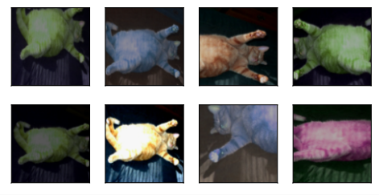

# 🥞 HW3-CNN: Food Classification

## 📖 Introduction

[HW3](https://www.kaggle.com/competitions/ml2023spring-hw3)) 的任务是食物图片分类，共 **11 个类别**。

- Training set: 10000 labeled images
- Validation set: 3643 labeled images
- Testing set: 3000 images without labeled

另外，在加载图像时，我们需要对其进行增广 (Augmentation)。

> 图像增广（image augmentation）技术通过对训练图像做一系列随机改变，来产生相似但又不同的训练样本，从而扩大训练数据集的规模
> 图像增广的另一种解释是，随机改变训练样本可以降低模型对某些属性的依赖，从而提高模型的泛化能力。
> 例如，我们可以对图像进行不同方式的裁剪，使感兴趣的物体出现在不同位置，从而减轻模型对物体出现位置的依赖性。
> 我们也可以调整亮度、色彩等因素来降低模型对色彩的敏感度。[(Zhang et al., 2023)](https://zh.d2l.ai/)



## 🎯 Baseline


|        | Public Baseline | Hints                                                     | Training Time                               | Public | Private |
| ------ | --------------- | --------------------------------------------------------- | ------------------------------------------- | ------ | ------- |
| Simple | 0.637           | Run Sample Code                                           | 0.5hr - 1hr on Colab                        | ✅     | ✅      |
| Medium | 0.700           | Do some Data Augmentation & Train longer                  | 1.5hr - 2hr on Colab                        | ✅     | ✅      |
| Strong | 0.814           | Use predefined CNN from torchvision or TensorFlow         | 10hr - 12hr on Colab (Suggest using Kaggle) | ✅     | ✅      |
| Boss   | 0.874           | Cross Validation + Ensemble or any other methods you know | 40+hr on Kaggle                             | ✅     | ✅      |

## ⚡ Quick Start

下载数据集：

```bash
wget https://github.com/hsushuai/ml2023spring-hw/releases/download/dataset/ml2023spring-hw3.zip

unzip ml2023spring-hw3.zip
```

运行 hw3：

```bash
python main.py hw3 --data_dir YOUR_DATA_DIRECTORY --output YOUR_OUTPUT_DIRECTORY
```

你需要将 `YOUR_DATA_DIRECTORY` 和 `YOUR_OUTPUT_DIRECTORY` 替换成实际的数据目录和输出目录，默认为 'data/ml2023spring-hw2'
和 'output'。

❗ 注意，请确保数据目录结构如下：

```text
data_dir/
│
├── test/
├── train/
└── valid/
```

## 📕 Docs

### Leader board Score


### Network Architecture

- resnet101 for torchvision

### Configs


| Section  | Parameter      | Value     |
| -------- | -------------- | --------- |
| model    | name           | resnet101 |
| training | batch_size     | 64        |
|          | max_epochs     | 1000      |
|          | learning_rate  | 0.001     |
|          | weight_decay   | 0.0001    |
|          | early_stopping | 200       |

更多详细配置请参考源代码 [hw3-configs](../configs/hw3-config.yaml)。

## 🎭 Tricks

- 使用 AdamW 作优化器
- augmentation:
  ```python
  transform_train = transforms.Compose([
              transforms.RandomResizedCrop(244, scale=(0.08, 1.0), ratio=(3.0 / 4.0, 4.0 / 3.0)),
              transforms.RandomHorizontalFlip(),
              transforms.ColorJitter(brightness=0.4, contrast=0.4, saturation=0.4),
              transforms.ToTensor(),
              transforms.Normalize([0.4914, 0.4822, 0.4465], [0.2023, 0.1994, 0.2010])])

  transform_test = transforms.Compose([
      transforms.Resize(256),
      transforms.CenterCrop(224),
      transforms.ToTensor(),
      transforms.Normalize([0.4914, 0.4822, 0.4465], [0.2023, 0.1994, 0.2010])])
  ```
- ensemble：对 test 数据集分别使用 transform_train 和 transform_test，然后合并两种输出。
  - $\text{logits} = 0.2 × \text{model}(\text{transform\_test}(\mathbf{X})) + 0.8 × \text{model}(
    \text{transform\_train}(\mathbf{X}))$

## 🙌 Contribute

如果你有更好的 Solution 欢迎分享。或者如果你遇到了什么问题，欢迎提交 issue。
